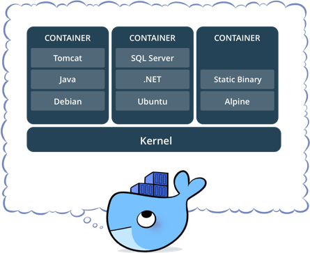

# MDP Dockerfiles

A few mdp oriented Dockerfiles for getting students up and running quickly.


## What is Docker

Docker is an open-source program that enables a Linux application and its dependencies to be packaged as a container.

Container-based visualization isolates applications from each other on a shared operating system (OS). This approach standardizes application delivery, allowing apps to run in any Linux (or Mac) environment, whether physical or virtual. Because they share the same operating system, containers are portable among different Linux distributions and are significantly smaller than virtual machine (VM) images. 

More importantnly it allows everyone who is working on an application (or workshop) to start with an identical setup.



## Installing Docker

General installation instructions are
[on the Docker site](https://docs.docker.com/installation/), but here are some
quick links:

* [OSX](https://docs.docker.com/installation/mac/): [docker toolbox](https://www.docker.com/toolbox)
* [ubuntu](https://docs.docker.com/installation/ubuntulinux/)


## Repositiory Structure

The dockerfiles in this repository are structured so that they stack,
starting at a base image, then core dependencies, up to higher level
applications or libraries. Because of Docker's "Automated Builds" 
changes to base images automativaly work their way in to images that 
have them as a dependency or starting point.

**The structure:**

```

buildpack-deps:jessie
|
|---mdp:latest
    |
    |--- mdp:python(or python3)
    |   |--- mdp:jupyter(or jupyter-python3)
    |       |--- nltk (Natural Language Toolkit)
    |
    |--- node.js


tensorflow/tensorflow:latest-gpu
|
|--- mdp:tensorflow
    |___ mdp:keras

``` 

Because the majority of MDP students and faculty are prototyping rather
than developing applications the images are MDP specific builds that are
closer to working in a linux development environment with base tools like
nano, vim, git, unzip, wget etc. which help with command line interaction,
there are "official" images (which these are based on) that are bare bones
and therefore less relevant for prototyping.

## Getting started
** Coming soon **

## Contributing
** Coming soon **